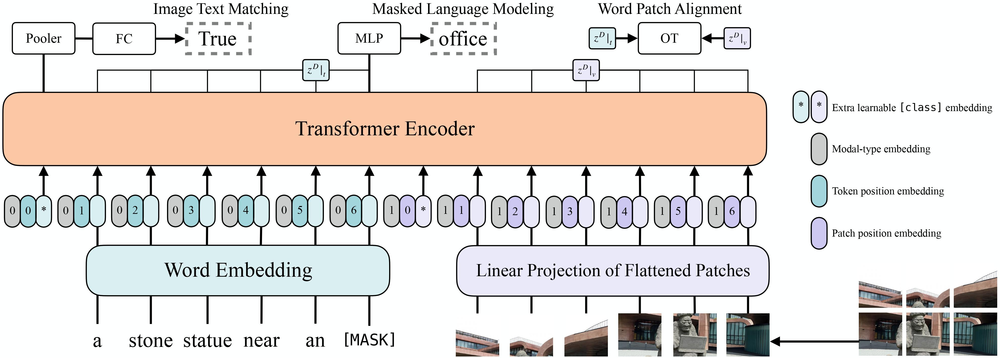
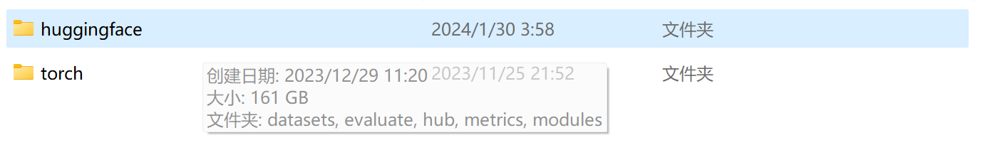
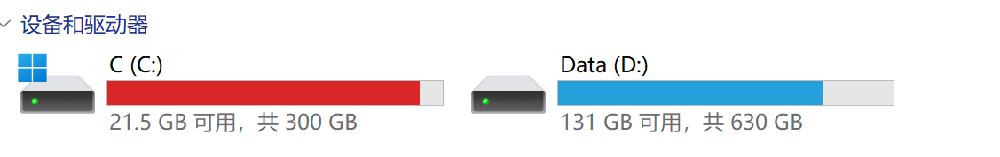

## 仓库地址

[teressssa/AI-Project5 (github.com)](https://github.com/teressssa/AI-Project5)

## 使用方法

原始数据需要自行放在仓库根目录下，首先执行`python preprocess.py`，然后可以依次执行testseq.ipynb，testmultimodal.ipynb两个notebook中的单元格

## 文件结构

```
|-- data 原始数据
|-- train.txt 原始训练数据
|-- test_without_label.txt 原始测试数据
|-- train.json 	存储训练数据
|-- val.json	存储验证数据
|-- test.json	存储测试数据
|-- preprocess.py 将数据存在json文件
|-- testmultimodal.ipynb 多模态模型
|-- testseq.ipynb  文本分类模型
|-- test_with_label.txt 使用多模态模型预测结果
|-- test_with_label_textonly.txt 仅使用文本分类模型预测结果(准确率应该较高)
```

## 预处理

存储每个id和对应得文本，图片路径和标签。标签转换为int便于计算损失。并将训练集按9：1划分训练集和验证集。因为有乱码，所以使用unicode_escape进行encode

```python
def tag_to_int(tag):
    if tag == "negative":
        return 0
    elif tag == "neutral":
        return 1
    elif tag == "positive":
        return 2

test = []

with open("test_without_label.txt", "r") as f:
    reader = csv.reader(f)
    next(reader)  # Skip the header
    for row in reader:
        with open(f"data/{row[0]}.txt", "r", encoding="unicode_escape") as txt_file:
            reader_txt = csv.reader(txt_file)
            txt = next(reader_txt)[0]
            test.append(
                {
                    "id": row[0],
                    "text": txt,
                    "label": tag_to_int(row[1]),
                    "path": f"data/{row[0]}.jpg",
                }
            )
```

存储在json文件中方便下次使用

```python
import json

with open("train.json", "w") as f:
    json.dump(train, f, indent=4)
with open("val.json", "w") as f:
    json.dump(val, f, indent=4)
with open("test.json", "w") as f:
    json.dump(test, f, indent=4)
```

## 模型

模型采用的是huggingface中的ViltForImagesAndTextClassification。对文本进行tokenize，对图像进行特征提取，将得到的对应向量传入模型，得到分类结果。



## 代码流程

1. 加载数据集。以json格式读取之前创建好的数据集

   ```python
   from datasets import DatasetDict, load_dataset
   
   train_dataset = load_dataset("json", data_files="train.json")["train"]
   test_dataset = load_dataset("json", data_files="test.json")["train"]
   val_dataset = load_dataset("json", data_files="val.json")["train"]
   
   # Create a DatasetDict
   mydb = DatasetDict({"train": train_dataset, "val": val_dataset, "test": test_dataset})
   
   print(mydb)
   ```

   ```
   DatasetDict({
       train: Dataset({
           features: ['label', 'id', 'path', 'text'],
           num_rows: 3600
       })
       val: Dataset({
           features: ['label', 'id', 'path', 'text'],
           num_rows: 400
       })
       test: Dataset({
           features: ['label', 'id', 'path', 'text'],
           num_rows: 511
       })
   })
   ```

2. 加载模型和处理器（processor），processor中包含了特征提取和tokenize的功能。

   ```python
   from transformers import ViltConfig, ViltForImagesAndTextClassification
   
   id2label = {0: "NEGATIVE", 1: "NEUTRAL", 2: "POSITIVE"}
   label2id = {"NEGATIVE": 0, "NEUTRAL": 1, "POSITIVE": 2}
   
   # Initializing a ViLT dandelin/vilt-b32-mlm style configuration
   configuration = ViltConfig(num_images=1, id2label=id2label, label2id=label2id)
   
   # Initializing a model from the dandelin/vilt-b32-mlm style configuration
   model = ViltForImagesAndTextClassification(configuration)
   
   
   processor = ViltProcessor.from_pretrained("dandelin/vilt-b32-mlm")
   ```

   

3. 对数据集进行预处理。对图像统一放缩至224x224，对token进行截断和填充，使每个批量的向量大小都相同。

   ```python
   def preprocess_function(examples):
       images = [Image.open(path).resize((224, 224)) for path in examples["path"]]
       texts = examples["text"]
       encoding = processor(
           images,
           texts,
           return_tensors="pt",
           padding=True,
           truncation=True,
       )
       encoding["labels"] = examples["label"]
       return encoding
   
   
   processed_db = mydb.map(preprocess_function, batched=True, batch_size=256)
   ```

   处理后的数据集

   ```python
   DatasetDict({
       train: Dataset({
           features: ['id', 'path', 'text', 'label', 'input_ids', 'token_type_ids', 'attention_mask', 'pixel_values', 'pixel_mask', 'labels'],
           num_rows: 3600
       })
       val: Dataset({
           features: ['id', 'path', 'text', 'label', 'input_ids', 'token_type_ids', 'attention_mask', 'pixel_values', 'pixel_mask', 'labels'],
           num_rows: 400
       })
       test: Dataset({
           features: ['id', 'path', 'text', 'label', 'input_ids', 'token_type_ids', 'attention_mask', 'pixel_values', 'pixel_mask', 'labels'],
           num_rows: 511
       })
   })
   ```

4. 设置评估标准为准确率

   ```python
   import numpy as np
   import evaluate
   
   accuracy = evaluate.load("accuracy")
   
   def compute_metrics(eval_pred):
       predictions, labels = eval_pred
       predictions = np.argmax(predictions, axis=1)
       return accuracy.compute(predictions=predictions, references=labels)
   ```

5. 使用默认的dataloader批量加载数据。因为在预处理的时候已经确保向量大小相同，所以不需要带填充的dataloader。

   ```python
   from transformers import DefaultDataCollator
   
   data_collator = DefaultDataCollator()
   ```

6. 进行训练

   ```python
   from transformers import TrainingArguments, Trainer
   
   training_args = TrainingArguments(
       output_dir="multimodalmodel",
       learning_rate=2e-5,
       per_device_train_batch_size=32,
       per_device_eval_batch_size=32,
       num_train_epochs=5,
       weight_decay=0.01,
   )
   
   
   trainer = Trainer(
       model=model,
       args=training_args,
       train_dataset=processed_db["train"],
       eval_dataset=processed_db["val"],
       tokenizer=processor,
       data_collator=data_collator,
       compute_metrics=compute_metrics,
   )
   
   trainer.train()
   ```

   

## 实验结果

因为model必须输入文本和图像，所以采用全白图像和空文本作为默认输入进行消融实验。

| 准确率 | 默认输入 | 仅图像 | 仅文本 |
| ------ | -------- | ------ | ------ |
| 训练集 | 0.6175   | 0.6133 | 0.4044 |
| 测试集 | 0.5725   | 0.5625 | 0.3825 |

可以看到默认输入与仅图像输入相差不大，而且仅文本效果较差

还有一点奇怪的是，只用文本进行训练，tokenizer是distilbert-base-uncased，在训练集上的准确率为0.7813，在验证集上的准确率为0.7225。

而多模态模型的tokenizer是bert-base-uncased，tokenizer的效果应该是相近的，但是结果相差比较大。

## 遇到的问题

1. 重复读取数据集导致缓存过大。解决方法：删除缓存。

   

   


2. 使用云主机时连接不上huggingface。解决方法：查阅官方文档进行加速

   ```python
   # autodl加速，如果不是使用autodl，可以注释掉
   import subprocess
   import os
   
   result = subprocess.run(
       'bash -c "source /etc/network_turbo && env | grep proxy"',
       shell=True,
       capture_output=True,
       text=True,
   )
   output = result.stdout
   for line in output.splitlines():
       if "=" in line:
           var, value = line.split("=", 1)
           os.environ[var] = value
   ```

3. transformers库中的bug。解决方法：手动更改源代码

   在transformers\models\vilt\modeling_vilt.py中的下面代码后加上

   ```python
   if pixel_values is not None and pixel_values.ndim == 4:
       # add dummy num_images dimension
       pixel_values = pixel_values.unsqueeze(1)
   if image_embeds is not None and image_embeds.ndim == 3:
       # add dummy num_images dimension
       image_embeds = image_embeds.unsqueeze(1)
   ```

   ```python
   if pixel_mask is not None and pixel_mask.ndim == 3:
       # add dummy num_images dimension
       pixel_mask = pixel_mask.unsqueeze(1)
   ```

## 总结

本次实验学习到了多模态任务的基本流程以及huggingface中许多函数的用法。在实验过程中也遇到了许多bug，通过查询官方文档，直接查看库中的文件，基本上都解决了。